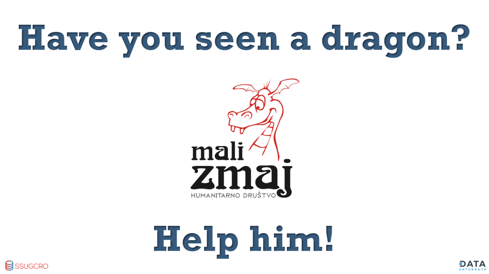
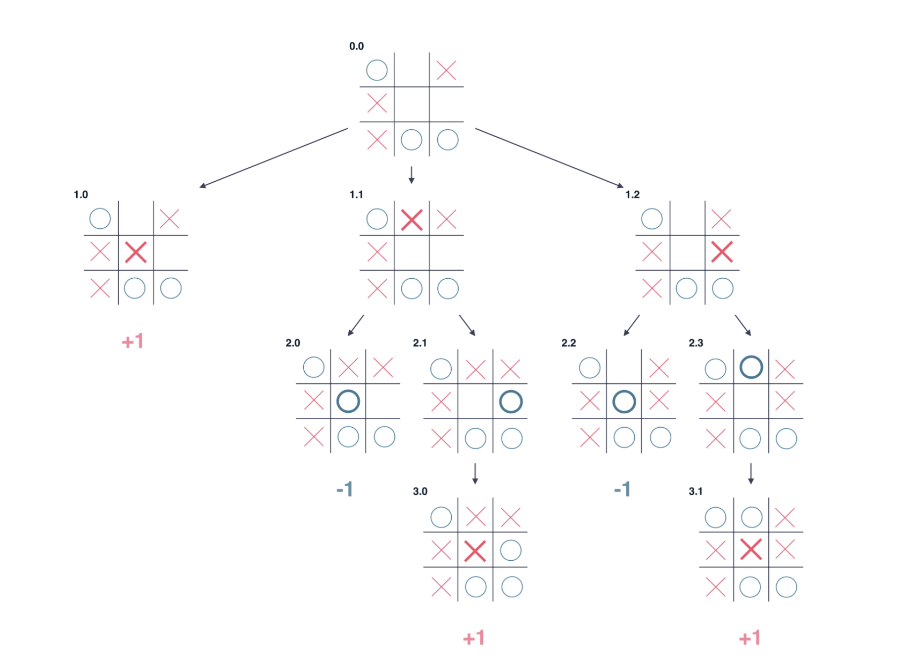

# **Writing boardgames with T-SQL**

T-SQL games for SQL Server and Azure SQL

(Tomaž Kaštrun,MVP)

http://github.com/tomaztk/t-sql-games

---


---


___

# About

- BI Developer and Data Scientist
- MSSQL, SAS, R, Py, C#, SAP, SPSS
- 20+years experience MSSQL, DEV, BI, DM
- MVP, MSCA, MCP, MCT
- Avid coffee drinker & Bicycle junkie


---
# Agenda

    * T-SQL functions
    * Matrix problems (inputs and boards)
    * Time complex problems O(n)
    * Input controls (looping through user inputs?)
    * Quazi AI ?
    * Viewing results
    * Comparison with script languages and benchmark

**Games / Demos:**
<style scoped>section { font-size: 30px; }</style>
    - Sudoku
    - Tic-Tac-Toe
    - Mastermind
    - Battleship
    - Tic-Tac-Toe
    - Walking through the maze
    - Classical (Mystery, maze,…)


---

# T-SQL Functions

- Mathematical (abs, cos, sin, pi, rand, power, ceiling,…)
- Ranking and Analytical (lag, lead, first_value, dense_rank, rank, row_number, …)
- Aggregate (avg, count, max,min, grouping, var, stdev,…)
- String (replace, ltrim, rtrim,stuff, substring, nchar, patindex,…)

What about matrix() ?
And dictionary? Tuples? Lists?

---

# Matrix

- Scripting languages (R, Python, JS, Julia, …) have matrix
- Can iterate matrix[i][y], read, write
- T-SQL ?
    * CREATE TABLE
    * POPULATE TABLE
    * Function to get data from the table

:satisfied: >> Demo:  Show demo with Py vs. SQL matrix

---
# Arrays/tuples and dictionaries

`a=[]` or `a=[[]]` or `a = c(1,2,3,4,3,3,1,2,1,3)`
<style scoped>section { font-size: 30px; }</style>

## T-SQL limitations
-  :-1: Can not declare an empty dictionary
- :-1: Does not support multiple arrays of arrays (Postgres does!)
- :-1: There are no data types as dictionaries

## T-SQL "solutions" :shrug:
- must create table, store results and get the results back in dictionary manner
- Strings of values (that can be concatenated/split) in single cell

---

# Time complex problems

*Time complexity is the time needed by an algorithm expressed as a function of the size of a problem.*


- Time complexity =  $O(log2n)$ 
- Time complexity =  $O(n2)$
- Time complexity = $O(nlog_n)$
- Time complexity = $O(√n)$


source: https://www.bigocheatsheet.com/

:satisfied: >> Demo:  Show demo with Py vs. SQL with $O(n)$

<style scoped>section { font-size: 30px; }</style>

---
# Time complex problems with T-SQL

- SELECT statement without index (assuming table scan) would be $O(n)$
- SELECT with index (assuming table seek) would be $O(log_n)$


<style scoped>section { font-size: 30px; }</style>
** These are only estimates!

---


# Game Loops

**Quintessential example of a “game programming pattern”**

### The Pattern
A game loop runs continuously during gameplay. Each turn of the loop, it processes user input without blocking, updates the game state, and renders the game. It tracks the passage of time to control the rate of gameplay.

<style scoped>section { font-size: 30px; }</style>

```Python
while (true)
{
  processInput();
  update();
  render();
}
```
----
# Big O and loop statements

- linear time loops
- constant-time loops
- logarithmic time loops
- nested loop statements
- function call statements
- recursive function statements
 


----
# Input controls (user input w/o loops)

- controlling the objects
- continous input
- Keyboard, Yoke, Mouse, Trackball, gamepad, paddle, ... ?

```sql
EXEC usp_PlayTicTacToe 'a2', 'x'
--OR
EXEC ttt_PlayerMove O,C,2;
-- OR
EXEC dbo.get_grid  @x0 ,@y0, @w OUT
```
---
# Gaming economics

- A/B Testing 
- Making game playable (Rookie, Competent, Expert) 
- Gathering game statistics

---
# T-SQL hiccups

- Game loop
- Remotes
- T-SQL errors
    - counting NULLS
    - string operations (concatenate NULLS)
    - NOT IN for nullables
    - Implicit conversions


---
# Quazi AI


- use of ML for gameplay of objects, obstacles, ...
- use of ML in single-mode 
- Slow "AI" and long IF-ELSE statements



:satisfied: >> Demo: Example with Tic-Tac-Toe

---
# Idle Games

_Concept of Idle games is based on exponential math!_


Gameplay: 
<style scoped>section { font-size: 27px; }</style>
1. User is performing action = clickling {item1, item2}
2. Clicking is generating game currency {coins, diamonds, upgrades}
3. Making progress a.k.a. **progression wall** {upgrades become more expensive, not so accessible to the player}


---
# Idle Games  - Elements & T-SQL equvivalents

<style scoped>section { font-size: 25px; }</style>

Game loop can be achieved with following patterns. 

_Clicking:_ Is the way of gameplay. Clicking will get user to ugrades but game will stop (go idle) if not clicked for longer time.

_Currency:_ The main mode of purchasing upgrades, generators, multipliers, and bonuses. Can also be main goal of the game.

_Upgrades:_ Ways to improve currency production in exchange for large sums of currency. 

_Generators:_ Tools that generate currency on a specified time interval.

_Prestige/Ascencion/New Game Plus_: Reset all current progress in exchange for powerful upgrades, mighty multipliers, or other bonuses next time user plays.

_Run:_ A run in an idle game is the gameplay from game start to the prestige. So whenever a player performs a prestige, they start a new run.

---
# Idle Games  - Exponential function

<style scoped>section { font-size: 25px; }</style>
Growth of a function f(x) is a simple way to explain how fast the value of the function (cost of upgrades, generators, income per second, …) increases with x (number of generators, level of upgrades, …)

y = x vs. y = 0.1x² and remember Big (O) Notation ...

**Goal game**: Gather as much wood as possible with 1 log. Each time user click, generates 1 item wood.

Example: Every click generates additional Item
Initial Cost = 10 coins
Growth Rabe: 15% per Level
Cost at Level 5/20/100

Hire an agent: generates 10 items per second
initial cost=100 cois
Growth rate = 7% per Level
Cost at 5/20/100 for agents: 131/361/81.095

---
# Games

- Sudoku
- Tic-Tac-Toe
- Mastermind
- Battleship
- Tic-Tac-Toe
- Classical (Mystery, maze, Walking through the maze)
- Tower of Hanoi
- Wordle :)

---
# Bonus: Drawings

- Spatial
- ASCII


---

# Thanks

Feel free to get in touch!

Demos, slides: Github:

[https://t.ly/vVm2](https://github.com/tomaztk/Games-with-TSQL)


