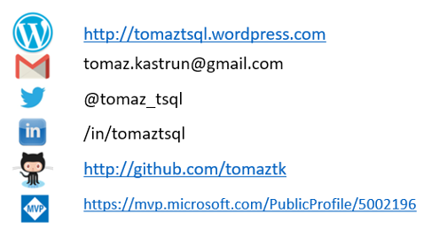
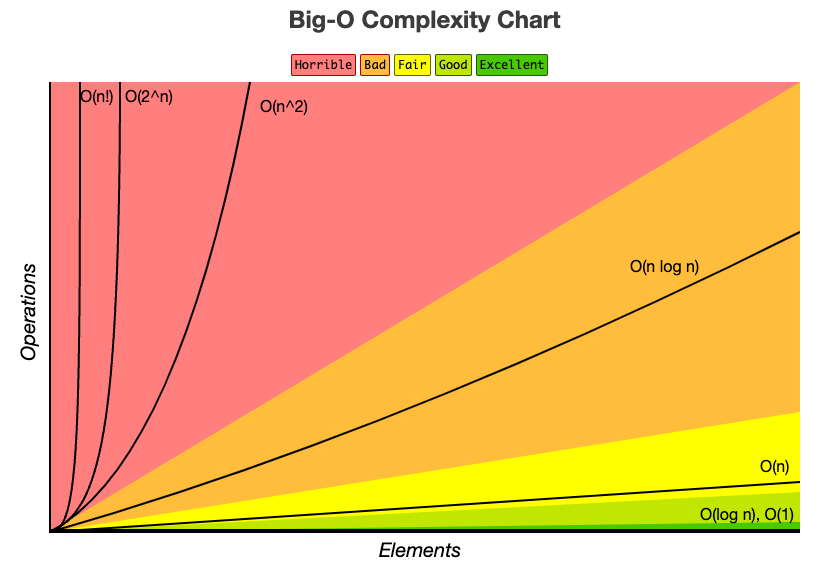

# **Writing boardgames with T-SQL**

T-SQL games for SQL Server and Azure SQL

(Tomaž Kaštrun,MVP)

http://github.com/tomaztk/t-sql-games

---

# About

- BI Developer and Data Scientist
- MSSQL, SAS, R, Py, C#, SAP, SPSS
- 20+years experience MSSQL, DEV, BI, DM
- MVP, MSCA, MCP, MCT
- Avid coffee drinker & Bicycle junkie



---
# Agenda

    * T-SQL functions
    * Matrix problems (inputs and boards)
    * Time complex problems O(n)
    * Input controls (looping through user inputs?)
    * Quazi AI ?
    * Viewing results
    * Comparison with script languages and benchmark

**Games / Demos:**
<style scoped>section { font-size: 30px; }</style>
    - Sudoku
    - Tic-Tac-Toe
    - Mastermind
    - Battleship
    - Tic-Tac-Toe
    - Walking through the maze
    - Classical (Mystery, maze,…)


---

# T-SQL Functions

- Mathematical (abs, cos, sin, pi, rand, power, ceiling,…)
- Ranking and Analytical (lag, lead, first_value, dense_rank, rank, row_number, …)
- Aggregate (avg, count, max,min, grouping, var, stdev,…)
- String (replace, ltrim, rtrim,stuff, substring, nchar, patindex,…)

What about matrix() ?
And dictionary? Tuples? Lists?

---

# Matrix

- Scripting languages (R, Python, JS, Julia, …) have matrix
- Can iterate matrix[i][y], read, write
- T-SQL ?
    * CREATE TABLE
    * POPULATE TABLE
    * Function to get data from the table

:satisfied: >> Demo:  Show demo with Py vs. SQL matrix

---
# Arrays/tuples and dictionaries

`a=[]` or `a=[[]]` or `a = c(1,2,3,4,3,3,1,2,1,3)`
<style scoped>section { font-size: 30px; }</style>

## T-SQL limitations
-  :-1: Can not declare an empty dictionary
- :-1: Does not support multiple arrays of arrays (Postgres does!)
- :-1: There are no data types as dictionaries

## T-SQL "solutions" :shrug:
- must create table, store results and get the results back in dictionary manner
- Strings of values (that can be concatenated/split) in single cell

---

# Time complex problems

*Time complexity is the time needed by an algorithm expressed as a function of the size of a problem.*


- Time complexity =  $O(log2n)$ 
- Time complexity =  $O(n2)$
- Time complexity = $O(nlog_n)$
- Time complexity = $O(√n)$



source: https://www.bigocheatsheet.com/

:satisfied: >> Demo:  Show demo with Py vs. SQL with $O(n)$

<style scoped>section { font-size: 30px; }</style>

---

# Game Loops

**Quintessential example of a “game programming pattern”**

### The Pattern
A game loop runs continuously during gameplay. Each turn of the loop, it processes user input without blocking, updates the game state, and renders the game. It tracks the passage of time to control the rate of gameplay.

<style scoped>section { font-size: 30px; }</style>

```Python
while (true)
{
  processInput();
  update();
  render();
}
```
----
# Big O and loop statements

- linear time loops
- constant-time loops
- logarithmic time loops
- nested loop statements
- function call statements
- recursive function statements
 


----
# Input controls (user input w/o loops)

- controlling the objects
- continous input
- 

---
# Gaming economics


---
# Quazi AI

- use of ML for gameplay of objects, obstacles, ...
- use of ML in single-mode 


---
# Games

http://maxgontar-code.blogspot.com/2010/01/fun-with-sql-games-painting-puzzles.html